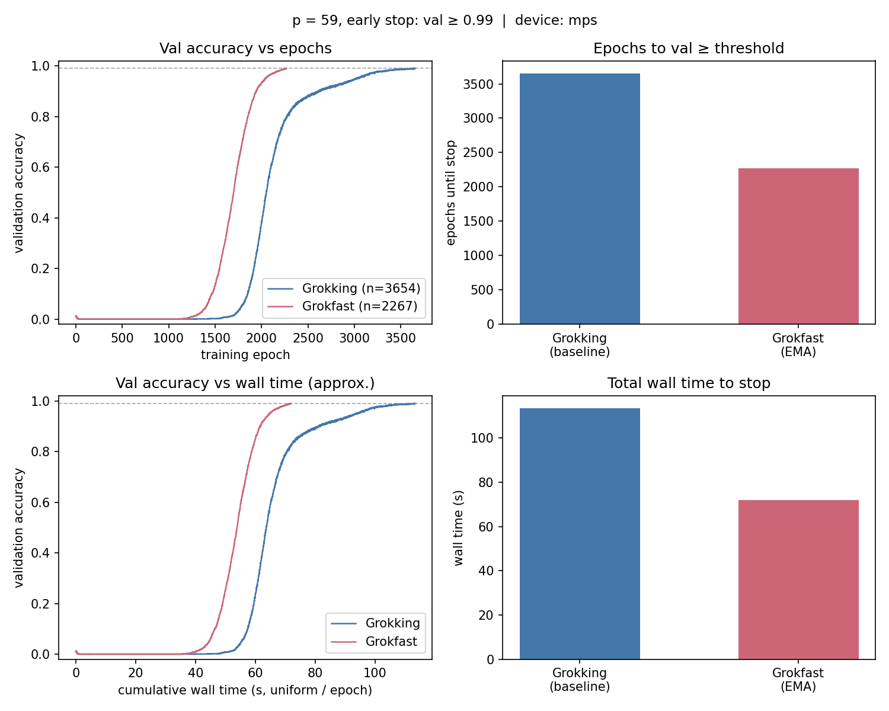
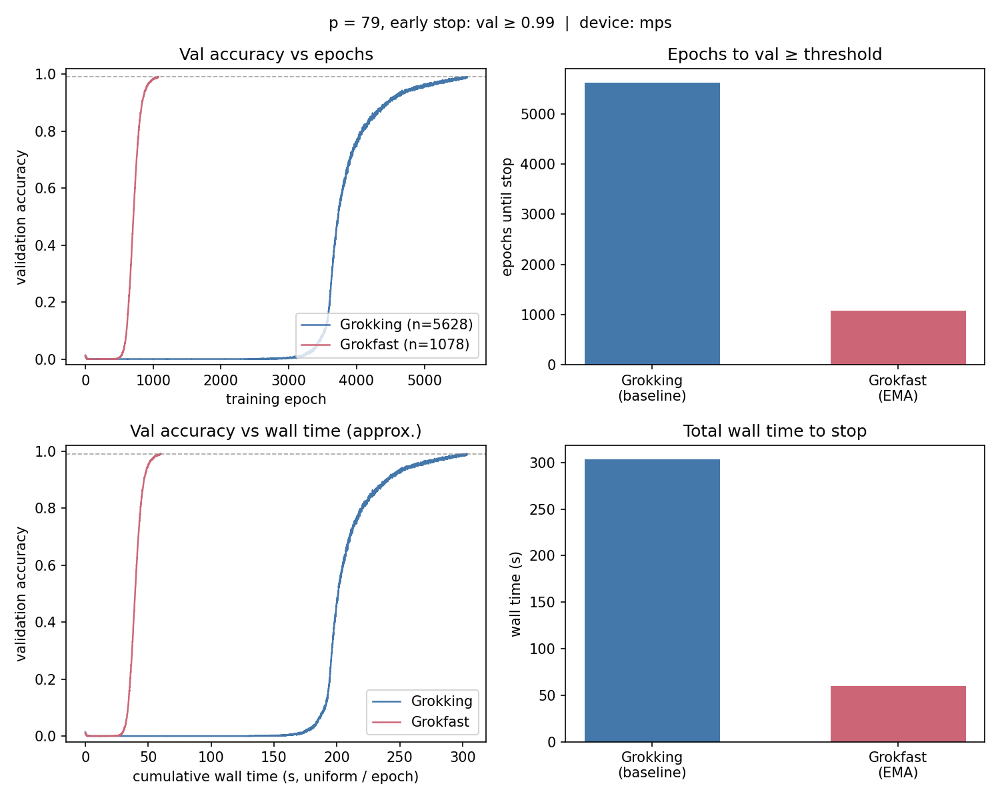
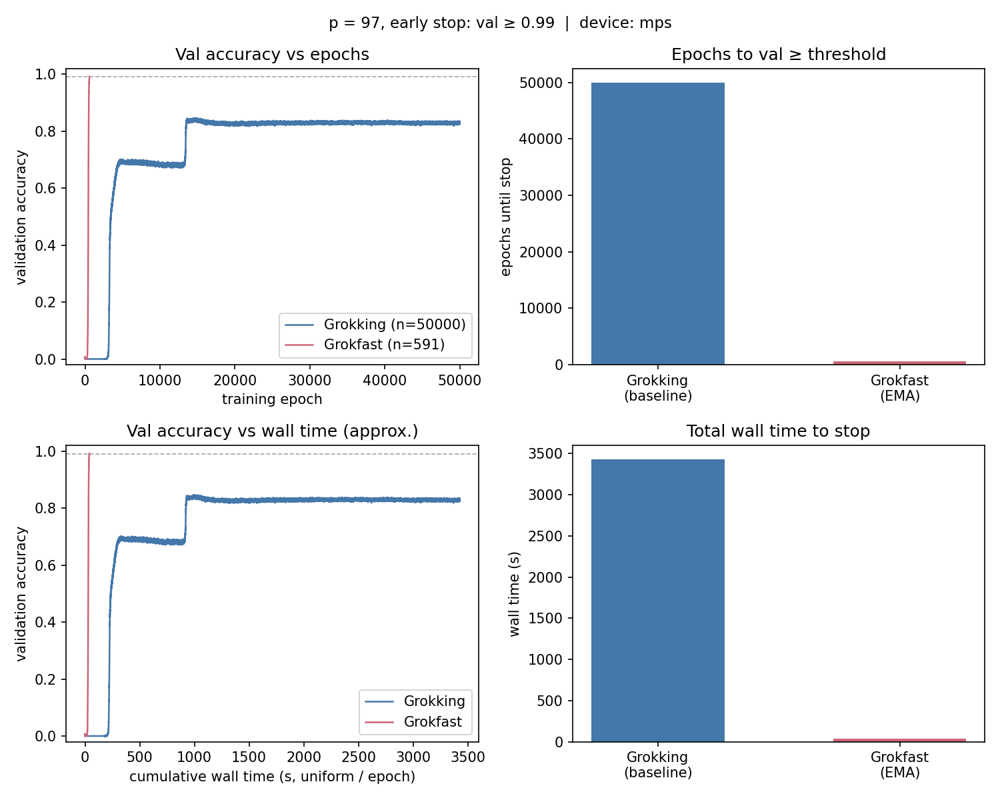

# Grokking vs Grokfast (toy demos)

Small PyTorch demos of **delayed generalization (“grokking”)** on toy algorithmic tasks, and **Grokfast**, a gradient post-processing trick that often makes that generalization phase arrive much sooner.

## What is grokking?

**Grokking** is the pattern where a network first **fits the training set** (often with near-perfect training accuracy) while **validation / test performance stays poor**—as if it were memorizing—then, after **many more training steps**, **generalization suddenly improves** sharply. It was popularized on small modular tasks (e.g. [Power et al., *Grokking*](https://arxiv.org/abs/2201.02177)).

Here one task is **modular addition**: predict \((a + b) \bmod p\) for all pairs \((a,b)\) with a held-out random fraction of pairs for validation. With **weight decay** and long training, you typically see train accuracy climb first and validation lag behind, then catch up.

A second task is **synthetic sequence modeling**: a tiny Transformer learns to **reverse** random strings over a small alphabet (see `grokking_synthetic_lm.py`).

## What is Grokfast?

**[Grokfast: Accelerated Grokking by Amplifying Slow Gradients](https://arxiv.org/abs/2405.20233)** treats per-parameter gradients over time as a signal, emphasizes **slow-varying** components, and adds them back into `p.grad` **after** `loss.backward()` and **before** `optimizer.step()`. This repo implements the reference **EMA** and **moving-average (MA)** filters in `grokfast.py` (same idea as the [reference code](https://github.com/ironjr/grokfast)).

## Grokfast gradient filter (mechanism)

For each trainable parameter, let \(g_t\) be the gradient tensor after the usual `loss.backward()` at step \(t\). Grokfast **does not** change the loss or the backward pass; it only **rewrites** the tensor the optimizer reads:

\[
g^{\mathrm{eff}}_t = g_t + \lambda \, s_t
\]

where \(s_t\) is a **smoothed** summary of recent gradients (slow component), and \(\lambda\) is a gain (`lamb` in code). The optimizer then uses \(g^{\mathrm{eff}}_t\) as `p.grad`.

**Intuition:** high-frequency oscillations in \(g_t\) average out in \(s_t\); directions that stay consistent over many steps accumulate. The paper argues that boosting those **slow** directions speeds up the transition from memorization-like fits to rule-like generalization (grokking).

### EMA filter (`gradfilter_ema`)

Maintains one state tensor \(h_t\) per parameter (same shape as \(g_t\)):

\[
h_t = \alpha \, h_{t-1} + (1-\alpha)\, g_t, \qquad
g^{\mathrm{eff}}_t = g_t + \lambda \, h_t.
\]

With \(\alpha\) close to 1 (default `0.98`), \(h_t\) is a **low-pass** (heavy-tailed exponential moving average) over past gradients. Default \(\lambda = 2\) (`lamb`).

### Moving-average filter (`gradfilter_ma`)

Keeps a deque of the last `window_size` gradients \(\{g_{t-W+1},\ldots,g_t\}\). Let \(\bar g_t\) be their **mean** (or **sum** if `filter_type="sum"`). After optional warmup until the deque is full:

\[
g^{\mathrm{eff}}_t = g_t + \lambda \, \bar g_t.
\]

This is a **finite-window** low-pass; default `window_size=100`, `lamb=5.0`.

**Placement:** call the chosen filter on the module **after** `backward()` and **before** `optimizer.step()` (see `train_one_epoch` in `grokking_modular_addition.py` and `grokking_synthetic_lm.py`).

## Setup

```bash
uv sync
```

Requires Python ≥ 3.10, PyTorch, and Matplotlib (see `pyproject.toml`).

## Running experiments

| Command | What it does |
|--------|----------------|
| `uv run python grokking_modular_addition.py` | Train with settings in `CFG` (default: vanilla / no Grokfast). |
| `uv run python grokking_modular_addition.py --grad-filter ema` | Same, but **Grokfast EMA** (or `ma` for the MA filter). |
| `uv run python grokking_modular_addition.py --compare` | Train baseline then Grokfast EMA on `CFG`, overlay validation curves. |
| `uv run python grokking_modular_addition.py --bench-prime P` | Run **baseline vs Grokfast EMA** with a fixed protocol, print epochs / wall time, save a **2×2 dashboard** PNG (default `benchmark_pP.png`). |
| `uv run python grokking_synthetic_lm.py` | **Tiny Transformer**, reverse-string task (defaults: `V=4`, `L=5`, `1024` sequences); train/val sequence accuracy + optional plot. |
| `uv run python grokking_synthetic_lm.py --grad-filter ema --epochs 8000 --plot reverse.png` | Same task with **Grokfast EMA** and custom epoch budget / figure path. |

Use `--output path.png` to set the figure path for a single run, `--compare`, or `--bench-prime`.

For `grokking_synthetic_lm.py`, use `--plot` for the figure path; keep `vocab_size^seq_len ≤ 50000` (the script enumerates all strings).

Device selection prefers **CUDA**, then **Apple MPS**, then **CPU** (see `_default_accelerator()` in each training script).

## Tiny Transformer: reverse strings (`grokking_synthetic_lm.py`)

- **Task:** Every string of length `L` over a vocabulary of size `V` (default `V=4`, `L=5` → `4^5 = 1024` sequences). The model must predict the **token-wise reverse** (same length). **Sequence-level accuracy** = fraction of strings where **all** positions are correct.
- **Model:** Encoder-only Transformer (`nn.TransformerEncoder`), learned token + position embeddings, GELU FFN, **full self-attention** (non-causal): all output logits are predicted in parallel from the input string (algorithmic “language modeling” without autoregressive decoding).
- **Training:** AdamW with weight decay (defaults in `SeqConfig`), random **50%** train / val split of sequences, same **Grokfast** hooks as the modular script (`--grad-filter none|ema|ma`).

Other algorithmic targets you can implement the same way: **copy**, **shift**, **parentheses well-formedness**, **fixed PCFG** strings, etc.

## Benchmark protocol

`--bench-prime P` runs two trainings with the **same seed and optimizer**:

- **Task:** all pairs for modulus `P`, **50%** random split train / validation.
- **Architecture:** 2 hidden layers, GELU MLP; **`hidden_dim = 256` if `P ≥ 97`, else `128`** (larger primes need more width to reach the stop criterion in reasonable time).
- **Optimizer:** AdamW, `lr=1e-3`, `weight_decay=1.0`, `batch_size=512`, `max_epochs=50_000`.
- **Stop rule:** first epoch with **validation accuracy ≥ 0.99** (otherwise full budget).
- **Dashboard:** four panels—val vs epoch, val vs *approximate* cumulative wall time (uniform seconds per epoch), bar chart of epochs to stop, bar chart of total wall seconds.

Exact numbers depend on **hardware, PyTorch version, and seed**. The table and figures below are from **Apple MPS**, **seed 0**, **Grokfast EMA** (`alpha=0.98`, `lamb=2.0`), Grokking = **no** gradient filter.

## Benchmark results

**Metric:** first training epoch where **validation accuracy ≥ 0.99** (modular addition, `--bench-prime`). **Wall time** is total seconds for that run until early stop (includes both train + eval each epoch).

| Modulus `p` | `hidden_dim` | Grokking epochs | Grokfast epochs | Grokking wall (s) | Grokfast wall (s) | Epoch ratio (G÷GF) | Wall ratio (G÷GF) |
|-------------|--------------|----------------:|----------------:|------------------:|------------------:|---------------------:|--------------------:|
| 59 | 128 | 3654 | 2267 | 113.4 | 71.9 | 1.61 | 1.58 |
| 79 | 128 | 5628 | 1078 | 303.3 | 60.1 | 5.22 | 5.05 |
| 97 | 256 | 7210 | 449 | 553.2 | 32.5 | 16.06 | 17.02 |

**Takeaway:** Grokfast reaches the same validation bar in **fewer epochs** and, with early stopping, **less wall time**; the gap widens as `p` increases in this setup (with `hidden_dim` scaled up for `p ≥ 97`).

**Reproduce** (writes the dashboard PNG and prints the same style summary):

```bash
uv run python grokking_modular_addition.py --bench-prime 59 --output benchmark_p59_dashboard.png
uv run python grokking_modular_addition.py --bench-prime 79 --output benchmark_p79_dashboard.png
uv run python grokking_modular_addition.py --bench-prime 97 --output benchmark_p97_dashboard.png
```

### Dashboard figures (in this repo)

| p = 59 | p = 79 |
|:------:|:------:|
|  |  |

| p = 97 |
|:------:|
|  |

Each figure: **top-left** val vs epoch; **bottom-left** val vs approximate cumulative time; **right** bars for epochs and total wall time to `val ≥ 0.99`.

## Project layout

| File | Role |
|------|------|
| `grokking_modular_addition.py` | Modular addition, MLP, CLI, benchmarks, plots. |
| `grokking_synthetic_lm.py` | Reverse-string task, tiny Transformer, Grokfast hooks. |
| `grokfast.py` | `gradfilter_ema`, `gradfilter_ma`. |

Dashboard PNGs used in [Benchmark results](#benchmark-results): `benchmark_p59_dashboard.png`, `benchmark_p79_dashboard.png`, `benchmark_p97_dashboard.png`.

## References

- A. Power et al., *Grokking: Generalization Beyond Overfitting on Small Algorithmic Datasets* — [arXiv:2201.02177](https://arxiv.org/abs/2201.02177).
- Y. Liu et al., *Grokfast: Accelerated Grokking by Amplifying Slow Gradients* — [arXiv:2405.20233](https://arxiv.org/abs/2405.20233).
